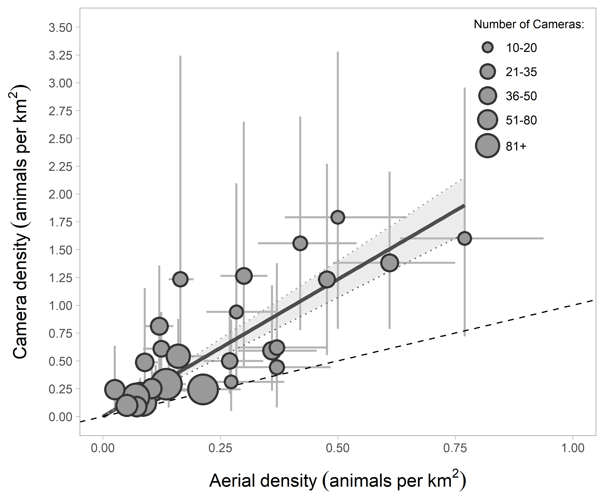
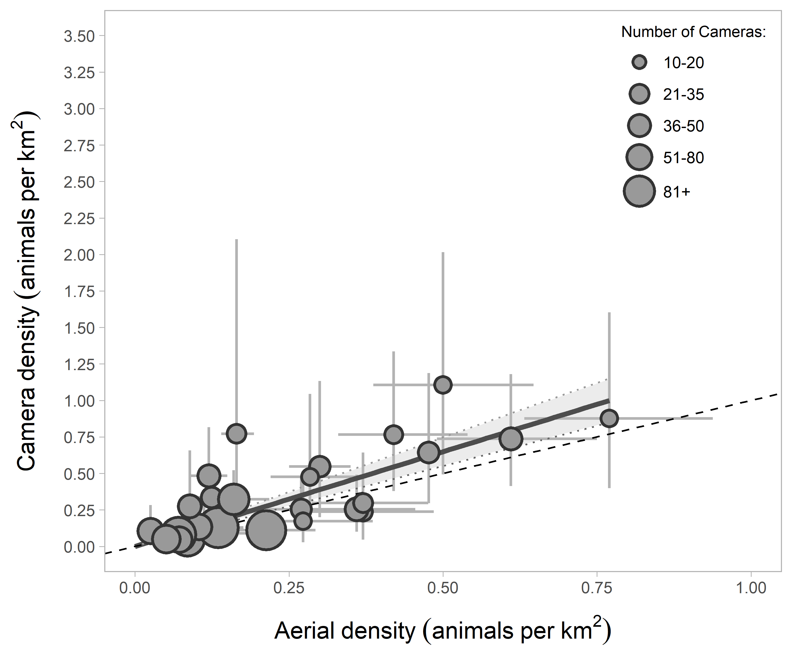

---
output:
  github_document:
    html_preview: true
---

```{r, include=FALSE, echo=FALSE, warning=FALSE}
library(knitr)
# Set knitr chunk options
opts_chunk$set(include=TRUE, echo=TRUE, message=FALSE, warning=FALSE, eval=TRUE, fig.path = "man/figures/")
```

# Estimating animal density using TIFC (Time In Front of Camera)

> This repository hosts data, code, and figures associated with the manuscript *Applying and testing a novel method to estimate animal density from motion-triggered cameras* (Becker et al.)

[](https://zenodo.org/badge/latestdoi/393173961)

## Repository Organization

This repository is organized in the following way:

  + All data can be found in the `data` folder. Raw data of the image tags described in the manuscript are located in the `base` subfolder; all other      supplemental data necessary to use the code is located in the `lookup` folder.
  + Code can be found in the `R` folder, which can be used to replicate various analyses described in the manuscript.
  + Application model results and figures are stored in the `results` folder.
  
Users are welcome to clone the repository and explore the data and code contained here. 
  
### Using the code

Within the `R` folder are the following subfolders:

  + `base` - This folder contains six numbered scripts that can be used to estimate density at individual cameras using the TIFC method. It is recommended to proceed through the scripts in the order indicated (e.g. beginning with `01_probabilistic-gaps.R`). These scripts carry out the probabilistic leaving modeling, estimation of effective detection distance, calculation of total time in front of the camera, etc. 
  + `assumptions` - This folder contains three scripts corresponding to each of the assumption testing analyses described in the manuscript (microhabitat, animal behaviour, perfect detection).
  + `application` - This folder contains the code associated with the Wildlife Management Unit (WMU) aerial survey / camera comparison.
  + `figures` - Code to reproduce each of the figures from the manuscript is located here.
  + `functions` - Contains several function used in the scripts above, including the function to summarise density at the WMU level using Monte Carlo simulation.
  
Throughout the scripts, intermediate data are saved to a `data/processed` subfolder. This subfolder, however, is included in the .gitignore file. Users are welcome to continue this convention, or can change the path to a folder on their local machine to save these objects there instead. 
  
## Application -- Moose Density in Wildlife Management Units of Alberta

In this paper we compared moose (*Alces alces*) density estimated via the TIFC method with that obtained from aerial ungulate surveys conducted by the Alberta provincial government (obtained [here](https://www.alberta.ca/aerial-wildlife-survey-reports.aspx)).

We used the following subset of 29 WMUs:

```{r fig5, out.width="50%", out.height="70%", fig.align="center", dpi=300, fig.cap="Location of Wildlife Management Units (WMUs) with available data from at least 15 camera deployments (2015-2020) and aerial surveys (2014-2020) within Alberta, Canada. Core sampling sites have 4 cameras placed in a square, separated by 600 m. Supplemental sites have 25 cameras with a minimum 1-km spacing within a 4 × 12 km area."}

knitr::include_graphics("./results/figures/Figure 5.png")

```

<br>

To compare the two methods, we fit a linear regression of camera density as a function of the aerial survey density (without intercept) in R v.4.0.4. Because of the number of cameras per WMU was highly variable (ranging from 15 to 217), we weighted the WMUs in inverse proportion to the square root of the number of cameras (as a proxy for the precision of camera estimate). Camera estimates were positively related to aerial survey estimates across WMUs (r^2^ = 0.84), but with wide uncertainty at the level of an individual WMU. On average, camera-derived moose density estimates were 2.47 times higher than aerial survey estimates (90% CI: 2.13 - 2.81).

```{r fig6, out.width="75%", out.height="75%", fig.align="center", dpi=300, fig.cap="Relationship between moose density estimated with cameras and with aerial surveys (solid line, shaded area is 90% confidence interval). The dashed line represents the 1:1 relationship. Error bars represent a 90% confidence interval in both the aerial and camera estimate."}

load("./results/models/wmu_application_model_output.rdata")

# Summarise linear model
summary(m.lm)



```

<br>

To illustrate how density estimates can be corrected for violation of assumptions, we removed the estimated time moose spent investigating the camera and pole (assumption 2, described in the manuscript) by habitat type, and re-calculated densities for each camera. With this adjustment, density estimates from camera traps were 1.3 times as high as estimates from aerial surveys (90% CI: 1.1-1.5).

```{r fig7, out.width="75%", out.height="75%", fig.align="center", dpi=300, fig.cap="Relationship between moose density estimated with cameras and with aerial surveys (solid line, shaded area is the 90% confidence interval), with adjustment made to the camera estimates to account for predicted time investigating the camera and pole. The dotted line represents the 1:1 relationship. Error bars represent 90% confidence intervals in both the aerial and camera estimates."}

# Summarise linear model using corrected densities
summary(m.lm.corr)



```

<br>

## License 

This repository is licensed under [MIT license](https://github.com/mabecker89/tifc-method/blob/main/LICENSE) © 2021 Marcus Becker, David J. Huggard, and the Alberta Biodiversity Monitoring Institute (ABMI). 


