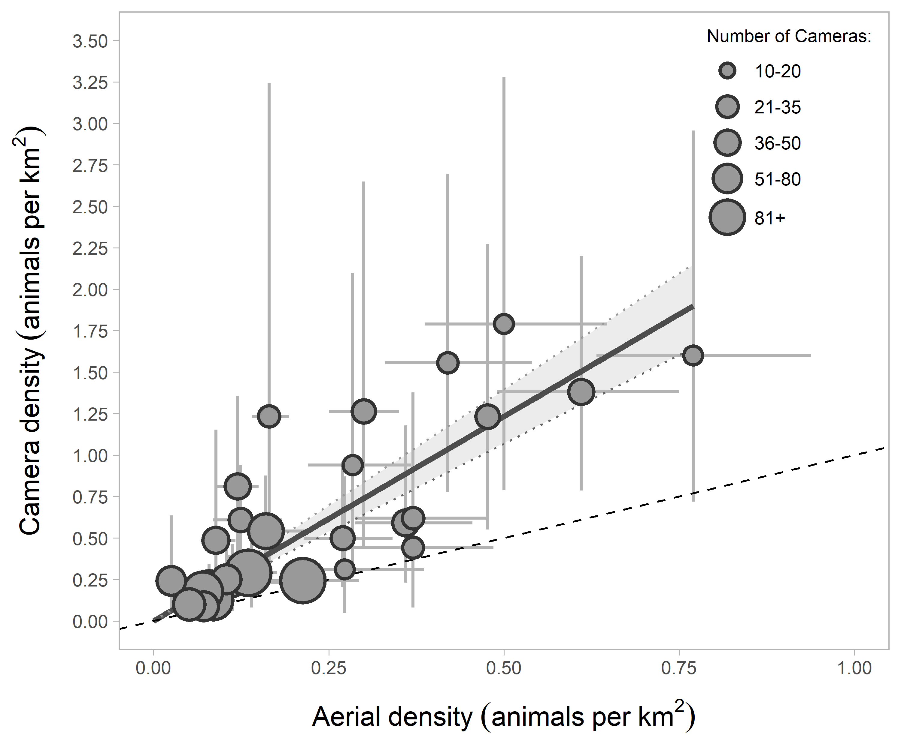
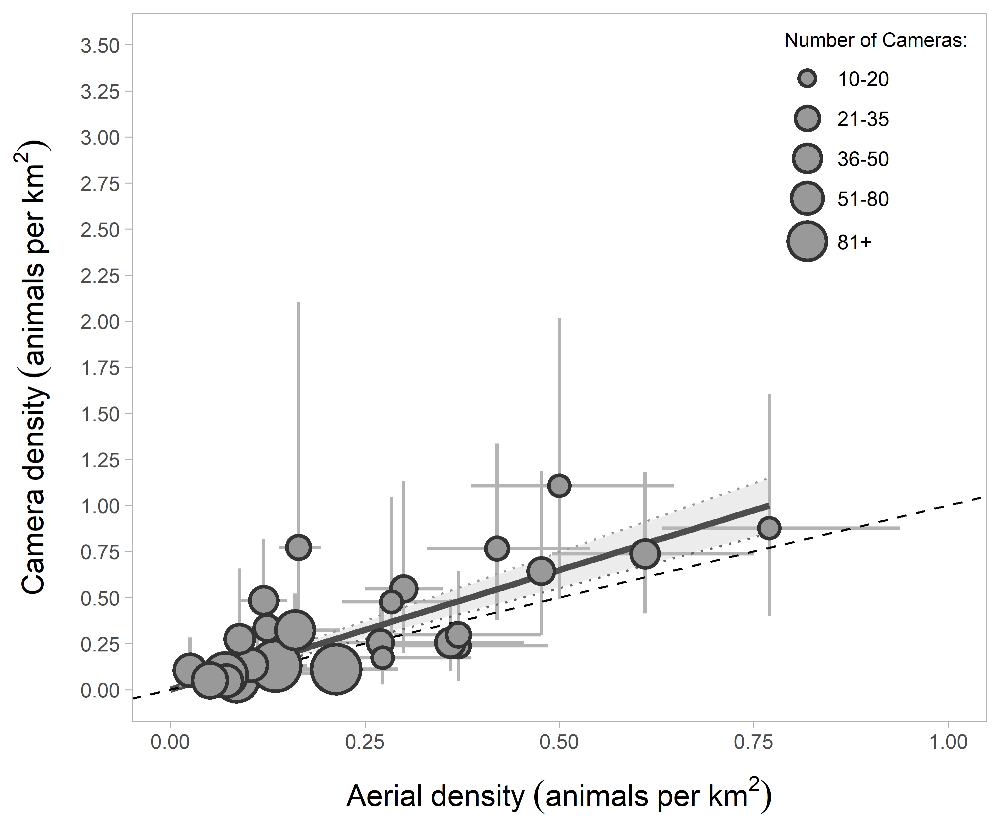

# Estimating animal density using TIFC (Time In Front of Camera)

> This repository hosts data, code, and analyses associated with the
> manuscript *Applying and testing a novel method to estimate animal
> density from motion-triggered cameras* (Becker et al.)

## Repository Organization

This repository is organized in the following way:

  - All data can be found in the `data` folder. Raw data of the image
    tags described in the manuscript are located in the `base`
    subfolder; all other supplemental data necessary to use the code is
    located in the `lookup` folder.
  - Code can be found in the `R` folder, which can be used to replicate
    various analyses described in the manuscript.
  - Application model results and figures are stored in the `results`
    folder.

### Using the code

Within the `R` folder are the following subfolders:

  - `base` - This folder contains six numbered scripts that can be used
    to estimate density at individual cameras using the TIFC method. It
    is recommended to proceed through the scripts in the order indicated
    (e.g. beginning with `01_probabilistic-gaps.R`). These scripts carry
    out the probabilistic leaving modeling, estimating of effective
    detection distance, calculation of total time in front of the
    camera, etc.
  - `assumptions` - This folder contains three scripts corresponding to
    each of the assumption testing analyses described in the manuscript
    (microhabitat, animal behaviour, perfect detection).
  - `application` - This folder contains the code associated with the
    Wildlife Management Unit (WMU) aerial survey / camera comparison.
  - `figures` - Code to reproduce each of the figures from the
    manuscript is located here.
  - `functions` - Contains several function used in the scripts above,
    including the function to summarise density at the WMU level using
    Monte Carlo simulation.

Throughout the scripts, intermediate data are saved to a
`data/processed` subfolder. This subfolder, however, is included in the
.gitignore file. Users are welcome to continue this convention, or can
change the path to a folder on their local machine to save these objects
there instead.

## Application – Moose Density in Wildlife Management Units of Alberta

In this paper we compared moose (*Alces alces*) density estimated via
the TIFC method with that obtained from aerial ungulate surveys
conducted by the Alberta provincial government (obtained
[here](https://www.alberta.ca/aerial-wildlife-survey-reports.aspx)).

We used the following subset of 29 WMUs:

``` r
knitr::include_graphics("./results/figures/Figure 5.png")
```

<div class="figure" style="text-align: center">


<p class="caption">

Location of Wildlife Management Units (WMUs) with available data from at
least 15 camera deployments (2015-2020) and aerial surveys (2014-2020)
within Alberta, Canada. Core sampling sites have 4 cameras placed in a
square, separated by 600 m. Supplemental sites have 25 cameras with a
minimum 1-km spacing within a 4 × 12 km area.

</p>

</div>

<br>

To compare the two methods, we fit a linear regression of camera density
as a function of the aerial survey density (without intercept) in R
v.4.0.4. Because of the number of cameras per WMU was highly variable
(ranging from 15 to 217), we weighted the WMUs in inverse proportion to
the square root of the number of cameras (as a proxy for the precision
of camera estimate). Camera estimates were positively related to aerial
survey estimates across WMUs (r<sup>2</sup> = 0.84), but with wide
uncertainty at the level of an individual WMU. On average,
camera-derived moose density estimates were 2.47 times higher than
aerial survey estimates (90% CI: 2.13 - 2.81).

``` r
load("./results/models/wmu_application_model_output.rdata")

# Summarise linear model
summary(m.lm)
```

    ## 
    ## Call:
    ## lm(formula = density_avg ~ aerial_avg - 1, data = df_sum_dens, 
    ##     weights = weight)
    ## 
    ## Weighted Residuals:
    ##      Min       1Q   Median       3Q      Max 
    ## -1.01442 -0.30045 -0.01344  0.48329  1.76813 
    ## 
    ## Coefficients:
    ##            Estimate Std. Error t value Pr(>|t|)    
    ## aerial_avg   2.4664     0.1991   12.39 7.01e-13 ***
    ## ---
    ## Signif. codes:  0 '***' 0.001 '**' 0.01 '*' 0.05 '.' 0.1 ' ' 1
    ## 
    ## Residual standard error: 0.7208 on 28 degrees of freedom
    ## Multiple R-squared:  0.8457, Adjusted R-squared:  0.8402 
    ## F-statistic: 153.5 on 1 and 28 DF,  p-value: 7.01e-13

``` r

```

<div class="figure" style="text-align: center">


<p class="caption">

Relationship between moose density estimated with cameras and with
aerial surveys (solid line, shaded area is 90% confidence interval). The
dashed line represents the 1:1 relationship. Error bars represent a 90%
confidence interval in both the aerial and camera estimate.

</p>

</div>

<br>

To illustrate how density estimates can be corrected for violation of
assumptions, we removed the estimated time moose spent investigating the
camera and pole (assumption 2, described in the manuscript) by habitat
type, and re-calculated densities for each camera. With this adjustment,
density estimates from camera traps were 1.3 times as high as estimates
from aerial surveys (90% CI: 1.1-1.5).

``` r
# Summarise linear model using corrected densities
summary(m.lm.corr)
```

    ## 
    ## Call:
    ## lm(formula = density_avg ~ aerial_avg - 1, data = df_sum_dens_corr, 
    ##     weights = weight)
    ## 
    ## Weighted Residuals:
    ##      Min       1Q   Median       3Q      Max 
    ## -0.59342 -0.21939 -0.03945  0.35250  1.19113 
    ## 
    ## Coefficients:
    ##            Estimate Std. Error t value Pr(>|t|)    
    ## aerial_avg   1.2985     0.1189   10.92 1.34e-11 ***
    ## ---
    ## Signif. codes:  0 '***' 0.001 '**' 0.01 '*' 0.05 '.' 0.1 ' ' 1
    ## 
    ## Residual standard error: 0.4306 on 28 degrees of freedom
    ## Multiple R-squared:  0.8098, Adjusted R-squared:  0.803 
    ## F-statistic: 119.2 on 1 and 28 DF,  p-value: 1.34e-11

``` r

```

<div class="figure" style="text-align: center">


<p class="caption">

Relationship between moose density estimated with cameras and with
aerial surveys (solid line, shaded area is the 90% confidence interval),
with adjustment made to the camera estimates to account for predicted
time investigating the camera and pole. The dotted line represents the
1:1 relationship. Error bars represent 90% confidence intervals in both
the aerial and camera estimates.

</p>

</div>

<br>

## License

This repository is licensed under [MIT
license](https://github.com/mabecker89/tifc-method/blob/main/LICENSE) ©
2021 Marcus Becker, David J. Huggard, and the Alberta Biodiversity
Monitoring Institute (ABMI).
